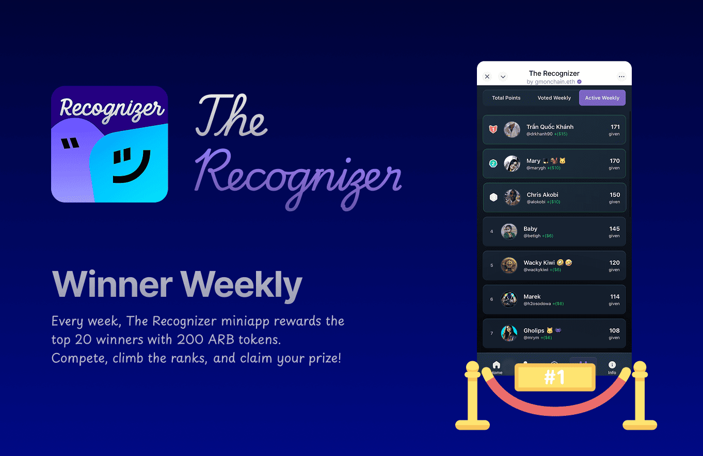
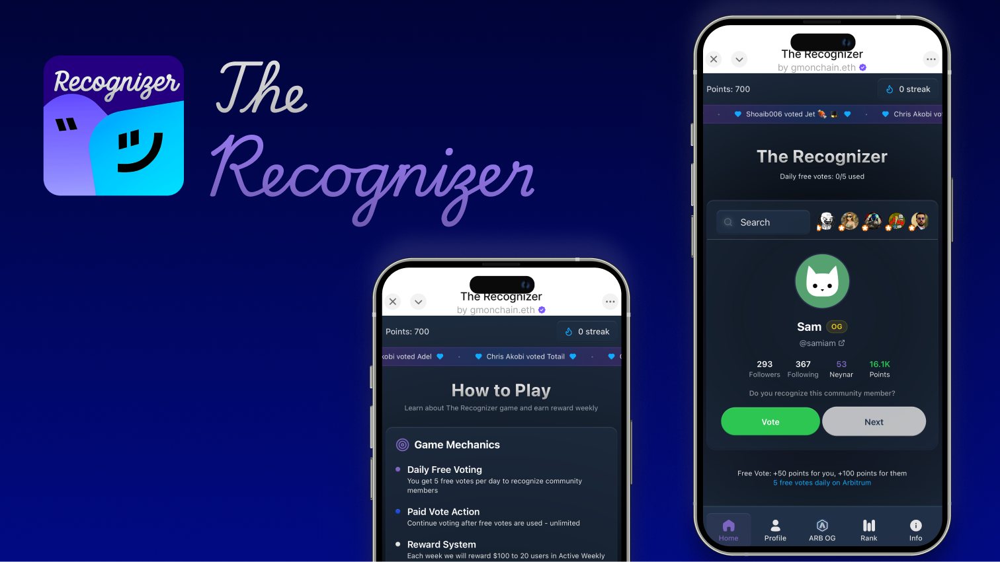

  

## Revolutionizing Community Recognition on Farcaster with Arbitrum

### The Problem: Unseen Contributions in Decentralized Communities

Farcaster communities thrive on valuable contributions, yet effectively identifying and rewarding their most impactful members remains a significant challenge. Traditional social media metrics often fall short, failing to capture the true depth of a member's influence. This leaves many valuable contributors unrecognized and under-incentivized, hindering organic community growth and engagement.

<table style="width:100%">
  <tr>
    <td style="width:50%; text-align:center;">
      
    </td>
    <td style="width:50%; text-align:center;">
      
    </td>
  </tr>
</table>

### How The Recognizer Solves It:

The Recognizer is a gamified social recognition platform built on the Arbitrum blockchain, designed to transform how Farcaster users acknowledge and reward valuable community members. We address the core issues of recognition and engagement through:

*   **Decentralized & Transparent Recognition:** Leveraging the power of blockchain technology, The Recognizer creates a transparent, immutable, and tamper-proof system for acknowledging contributions. Every recognition is on-chain, verifiable, and truly reflective of community sentiment.

*   **Incentivized & Gamified Participation:** We introduce a tokenized voting system that empowers users to recognize and reward others' contributions. Active participants are not only able to shape community recognition but also unlock special benefits, fostering a vibrant and rewarding ecosystem.

*   **Automatic OG Status Verification & Rewards:** The platform automatically detects and confers "OG Status" to original community members, granting them additional voting power and exclusive privileges. This ensures long-standing contributors are appropriately honored and empowered.

*   **Dynamic Engagement Mechanics:** To encourage consistent and meaningful interaction, The Recognizer incorporates engaging features such as recognition streaks, dynamic leaderboards, and tiered rewards. These mechanics drive sustained participation and cultivate a culture of appreciation.

### Empowering Your Community:

**For Community Members:**
*   **Earn Deserved Recognition:** Get acknowledged for your valuable contributions in a transparent and verifiable manner.
*   **Discover Influential Peers:** Easily identify and connect with other highly valued members within your niche communities.

**For Community Leaders:**
*   **Cultivate a Thriving Community:** Identify, incentivize, and reward your most engaged and impactful members with irrefutable, on-chain verification.
*   **Foster Organic Growth:** Build a more engaged and self-sustaining community by empowering members to recognize excellence.

**For Content Creators:**
*   **Amplify Your Impact:** Gain unparalleled visibility and recognition within your niche Farcaster communities, directly tied to the actual value and engagement your content generates.
*   **Monetize Your Influence:** Unlock new avenues for reward and collaboration based on your proven community impact.

### The Technical Advantage: Seamless & Efficient

The Recognizer's deep integration with Farcaster ensures a native and intuitive social experience, while its foundation on the Arbitrum network guarantees exceptionally low transaction costs and high efficiency. This powerful combination makes even micro-recognitions practical, meaningful, and accessible to everyone, truly democratizing appreciation in decentralized social spaces.

## Farcaster Mini App
Explore FarRank on Farcaster: [https://farcaster.xyz/miniapps/6oB9-350Smac/the-recognizer](https://farcaster.xyz/miniapps/6oB9-350Smac/the-recognizer)
